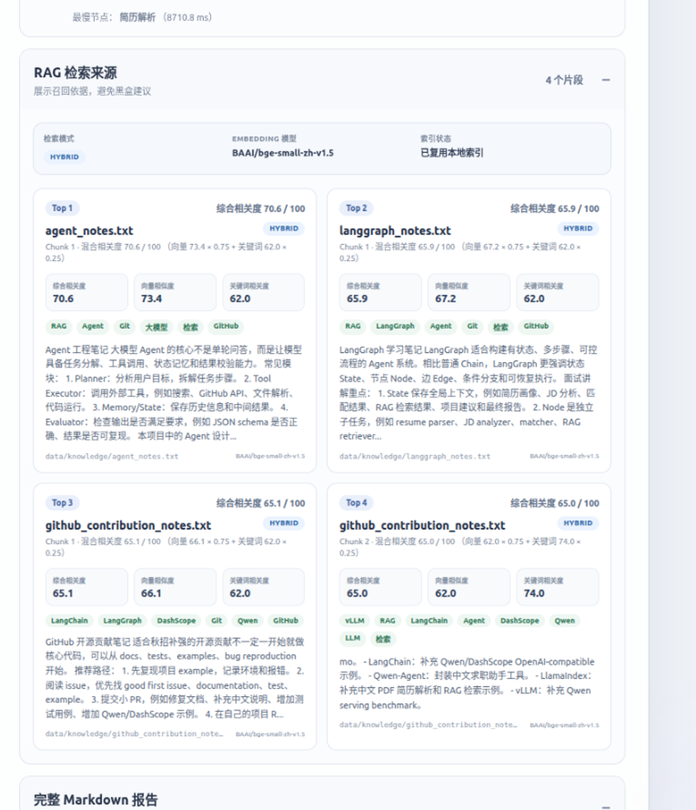
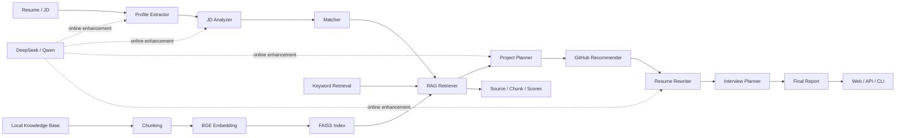

# CareerPilot-LangGraph

<p align="center">
  面向大模型 / Agent 岗位的智能求职分析系统<br/>
  Resume & JD Matching · LangGraph Workflow · Hybrid RAG · FastAPI · Docker
</p>

<p align="center">
  <a href="https://github.com/veipross/CareerPilot-LangGraph/actions/workflows/ci.yml"></a>
  
  
  
  
</p>

CareerPilot 输入候选人简历和岗位 JD，通过 LangGraph 编排 9 个节点，输出岗位匹配、技能差距、项目路线、GitHub 学习建议、简历改写和面试准备报告。系统支持 DeepSeek / Qwen 在线模型、完全离线降级、PDF 简历上传、可解释评分、Hybrid RAG、执行轨迹追踪、Docker 部署与自动化测试。

> 该项目用于求职准备与工程演示。匹配分仅表示当前技能词表下的技术覆盖情况，不代表录用概率，也不替代人工招聘判断。

## 核心成果

- 使用 `StateGraph` 构建 9 节点求职 Agent 工作流，保留完整中间状态和节点级执行轨迹。
- 使用 `BAAI/bge-small-zh-v1.5 + FAISS` 实现本地向量索引，并提供 `keyword / vector / hybrid` 三种检索模式。
- Hybrid RAG 相比关键词检索，将 **Hit@1 从 50.0% 提升至 87.5%**，**Hit@3 从 50.0% 提升至 100%**，**MRR 从 0.500 提升至 0.938**。
- 支持 DeepSeek / Qwen OpenAI-compatible API；外部模型失败或启用 Offline 模式时，自动回退到确定性规则链路。
- 支持 PDF、TXT、Markdown 简历上传，提供大小、页数、文件类型和文本可提取性校验。
- 提供 FastAPI Web Demo、JSON API、CLI、Docker Compose、GitHub Actions CI 和 40 项自动化测试。

## Web Demo

下面的 RAG 面板会展示检索模式、Embedding 模型、索引状态、来源文件、Chunk 编号、综合相关度、向量相似度和关键词相关度。

<p align="center">
  
</p>

## 系统架构



### LangGraph 节点

| 节点 | 主要输入 | 主要输出 | 作用 |
|---|---|---|---|
| `extract_profile` | 简历文本 | `profile` | 提取教育、技能、项目、优势与缺失信号 |
| `analyze_jd` | JD 文本 | `jd_profile` | 提取岗位职责、核心要求、工具与关键词 |
| `match` | 候选人画像 + JD 画像 | `match_report` | 计算标准化技能覆盖率和风险点 |
| `rag_retriever` | 岗位需求 + 技能缺口 | `rag_context` | 检索本地 LangGraph、RAG、Agent 与开源知识 |
| `project_planner` | 匹配结果 + RAG 上下文 | `project_plan` | 生成可执行项目路线与里程碑 |
| `github_recommender` | 技能缺口 | `github_recommendations` | 推荐学习仓库与开源贡献切入点 |
| `resume_rewriter` | 项目路线 + 岗位画像 | `resume_rewrite` | 生成可写入简历的项目描述 |
| `interview_planner` | 完整状态 | `interview_plan` | 生成问题、讲解要点与学习计划 |
| `final_report` | 完整状态 | `final_report` | 汇总为 Markdown 求职匹配报告 |

## Hybrid RAG

知识库位于 `data/knowledge/`。系统先进行文本切块，再使用 BGE 生成归一化向量并建立 FAISS `IndexFlatIP` 索引。索引与元数据会持久化到 `data/vector_store/`，知识库、模型或切块参数变化时自动重建。

Hybrid 模式综合向量语义分与关键词精确分：

```text
hybrid_score = vector_score × 0.75 + keyword_score × 0.25
```

支持的模式：

| 模式 | 说明 |
|---|---|
| `keyword` | 关键词重叠检索，速度快，适合精确技术词 |
| `vector` | BGE + FAISS 语义检索，适合改写和近义表达 |
| `hybrid` | 结合语义召回与精确词命中，项目默认推荐模式 |

当 Sentence Transformers、FAISS、Embedding 模型或索引不可用时，系统会自动回退到关键词检索，并在结果中返回降级原因。

## RAG 离线评估

固定评估集包含 8 条查询，覆盖精确技术词和语义改写两类场景。以下是预热后的本地结果：

| 模式 | Hit@1 | Hit@3 | MRR | 非空召回率 | 平均延迟 |
|---|---:|---:|---:|---:|---:|
| Keyword | 0.500 | 0.500 | 0.500 | 0.500 | 0.12 ms |
| Vector | 0.875 | 1.000 | 0.938 | 1.000 | 3.68 ms |
| Hybrid | 0.875 | 1.000 | 0.938 | 1.000 | 3.75 ms |

语义改写子集上，关键词检索的 Hit@3 为 `0.000`，Vector 与 Hybrid 均达到 `1.000`。该结果说明向量检索能够召回未直接复用知识库关键词的语义表达。

复现实验：

```bash
python scripts/evaluate_rag.py --repeat 3
```

报告输出到：

```text
outputs/rag_evaluation/rag_evaluation.json
outputs/rag_evaluation/rag_evaluation.md
```

> 当前评估集用于项目回归和工程对比，不应视为大规模通用 RAG 基准。

## 快速开始

### 1. 环境安装

```bash
git clone https://github.com/veipross/CareerPilot-LangGraph.git
cd CareerPilot-LangGraph

python -m venv .venv
source .venv/bin/activate
python -m pip install --upgrade pip
python -m pip install -e ".[dev]"
```

项目要求 Python `3.9+`。首次启用向量 RAG 时会下载约 100 MB 的 BGE 模型。

### 2. 配置环境变量

```bash
cp .env.example .env
```

`.env` 中可选择 DeepSeek 或 Qwen：

```env
CAREERPILOT_LLM_PROVIDER=deepseek
DEEPSEEK_API_KEY=your_key_here
CAREERPILOT_DEEPSEEK_BASE_URL=https://api.deepseek.com
CAREERPILOT_DEEPSEEK_MODEL=deepseek-v4-flash

CAREERPILOT_RAG_MODE=hybrid
CAREERPILOT_RAG_EMBEDDING_MODEL=BAAI/bge-small-zh-v1.5
CAREERPILOT_RAG_DEVICE=cpu
```

不要把 `.env` 或真实 API Key 提交到 Git。

### 3. 启动 Web Demo

```bash
python -m uvicorn careerpilot.api:app \
  --host 0.0.0.0 \
  --port 8001 \
  --env-file .env
```

浏览器访问：

```text
http://127.0.0.1:8001
```

Web 页面支持：

- 粘贴简历文本或上传 PDF / TXT / Markdown；
- 选择 DeepSeek、Qwen 或 Offline 模式；
- 查看匹配分、技能差距、9 节点执行轨迹和最慢节点；
- 查看 Hybrid RAG 来源、Chunk、相似度和索引状态；
- 查看和复制完整 Markdown 报告。

### 4. CLI 离线运行

无需 API Key：

```bash
careerpilot \
  --resume examples/sample_resume_zh.txt \
  --jd examples/sample_jd_llm_agent.txt \
  --out outputs/report.md \
  --offline
```

在线运行：

```bash
careerpilot \
  --resume examples/sample_resume_zh.txt \
  --jd examples/sample_jd_llm_agent.txt \
  --out outputs/report.md \
  --provider deepseek
```

`--resume` 和 `--jd` 均支持文本文件和可提取文字的 PDF。

## API

### 健康检查

```bash
curl http://127.0.0.1:8001/health
```

返回：

```json
{"status":"ok"}
```

### 简历文件解析

```bash
curl -X POST "http://127.0.0.1:8001/resume/extract" \
  -F "resume_file=@resume.pdf"
```

### 求职分析

```bash
curl -X POST "http://127.0.0.1:8001/analyze" \
  -H "Content-Type: application/json" \
  -d '{
    "resume_text": "Python、FastAPI、LangGraph 项目经验……",
    "jd_text": "负责大模型 Agent 应用开发……",
    "target_role": "大模型/Agent 工程实习生",
    "offline": true,
    "provider": "deepseek"
  }'
```

响应包含：

```text
final_report
match_score / match_level / match_breakdown
execution_trace / pipeline_metrics
rag_context
provider / offline
```

FastAPI 交互文档：

```text
http://127.0.0.1:8001/docs
```

## 可解释匹配评分

匹配总分采用标准化技能覆盖率：

```text
match_score = matched_normalized_skills / identifiable_required_skills × 100
```

同义表达会先归一化，例如 `大语言模型 / LLM`、`Fast API / FastAPI`。在线和离线模式使用同一套确定性评分逻辑，避免 LLM 措辞变化导致分数漂移。

运行高、中、低三档固定案例：

```bash
python scripts/evaluate_matching.py
```

## PDF 简历上传

- 支持 PDF、TXT 和 Markdown；
- 文件仅在内存中读取，不保存到服务器；
- 默认最大 8 MB，PDF 最多 60 页；
- 拒绝不支持的文件类型、空文件和异常 PDF；
- 扫描件或纯图片 PDF 不能直接提取文本，需要先进行 OCR 或改用文本粘贴。

## 可观测性

每个 LangGraph 节点都会记录：

```text
执行顺序
节点名称与中文标签
完成状态
节点耗时
输出字段
输出摘要
```

最终状态同时返回：

- `execution_trace`：节点级执行记录；
- `pipeline_metrics`：节点数量、累计耗时和最慢节点；
- `rag_context`：召回排名、来源、Chunk、分数、模型、索引状态与降级原因。

## Docker 部署

### Docker

```bash
docker build -t careerpilot-langgraph:local .
docker run --rm -p 8001:8001 careerpilot-langgraph:local
```

在线模式：

```bash
docker run --rm \
  -p 8001:8001 \
  --env-file .env \
  careerpilot-langgraph:local
```

镜像使用非 root 用户运行，并配置 `/health` 容器健康检查。

### Docker Compose

```bash
docker compose up --build -d
docker compose ps
docker compose logs -f careerpilot
```

停止：

```bash
docker compose down
```

## 测试与 CI

运行测试：

```bash
pytest -q
```

当前测试覆盖：

- 规则工具与技能归一化；
- 高、中、低匹配评估；
- LangGraph 服务和执行轨迹；
- FastAPI JSON / Web 路由；
- PDF 简历安全解析；
- Keyword / Vector / Hybrid RAG；
- Hit@K、MRR、延迟评估；
- Docker 和部署配置。

GitHub Actions 在 Python `3.9` 和 `3.11` 上运行源码编译与完整测试，并构建 Docker 镜像执行 `/health` smoke test。

## 项目结构

```text
CareerPilot-LangGraph/
├── careerpilot/
│   ├── api.py                    # FastAPI、Web 表单和文件上传
│   ├── cli.py                    # CLI 入口
│   ├── config.py                 # LLM 与 RAG 配置
│   ├── graph.py                  # 9 节点 LangGraph 工作流
│   ├── llm.py                    # 结构化 LLM 调用与解析
│   ├── llm_providers/            # DeepSeek / Qwen OpenAI-compatible 客户端
│   ├── rag.py                    # BGE、FAISS、索引持久化与 Hybrid 检索
│   ├── rag_evaluation.py         # Hit@K、MRR、延迟与报告生成
│   ├── resume_parser.py          # PDF / TXT / Markdown 安全解析
│   ├── schemas.py                # Pydantic 与 LangGraph State
│   ├── service.py                # CLI / API 共用服务层
│   ├── tools.py                  # 评分、关键词检索与确定性降级工具
│   ├── templates/index.html      # Web 页面
│   └── static/style.css          # 页面样式
├── data/
│   ├── knowledge/                # 本地 RAG 知识库
│   └── evaluation/rag_queries.json
├── examples/                     # 脱敏简历、JD 与示例报告
├── scripts/
│   ├── evaluate_matching.py
│   └── evaluate_rag.py
├── tests/                        # 40 项自动化测试
├── Dockerfile
├── docker-compose.yml
└── .github/workflows/ci.yml
```

## 技术栈

`Python` · `LangGraph` · `Pydantic` · `FastAPI` · `Jinja2` · `DeepSeek` · `Qwen/DashScope` · `Sentence Transformers` · `BGE` · `FAISS` · `PyPDF` · `Docker` · `GitHub Actions` · `Pytest`

## 安全与限制

- 不要提交 `.env`、API Key、真实简历、电话号码、邮箱或身份证信息。
- `data/vector_store/` 和运行输出应保持在 Git 忽略列表中。
- 匹配分是技能覆盖指标，不代表候选人综合能力或招聘结论。
- 当前知识库和评估集规模较小，重点展示可复现的 Agent / RAG 工程链路。
- 扫描版 PDF 目前不内置 OCR。

## 简历项目描述参考

> 基于 LangGraph 构建多节点智能求职 Agent，完成简历解析、JD 结构化分析、技能匹配、项目规划、开源推荐、简历改写和面试题生成，并通过 FastAPI 提供 Web 与 JSON API。

> 使用 BGE-small-zh-v1.5 与 FAISS 实现本地 Hybrid RAG，支持关键词、向量、混合检索及异常自动降级；在 8 条固定评估查询上，相比关键词检索将 Hit@1 从 50.0% 提升至 87.5%，Hit@3 从 50.0% 提升至 100%，MRR 从 0.500 提升至 0.938。

> 完成 PDF 简历安全上传、DeepSeek / Qwen 在线与 Offline 双模式、节点耗时和 RAG 来源追踪、Docker 部署、GitHub Actions CI，并以 40 项自动化测试保障工作流稳定性。
