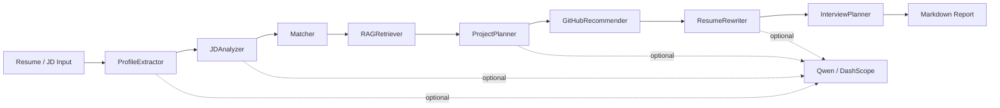

# CareerPilot-LangGraph

面向秋招的大模型 Agent 项目：输入简历和岗位 JD，使用 LangGraph 编排多个节点，自动生成岗位匹配、技能差距、GitHub 项目路线、简历改写和面试准备报告。

> 这个仓库适合用于大模型应用 / Agent 工程 / 算法实习岗位展示。它不是普通聊天机器人，而是一个有状态、多节点、可降级、可扩展工具调用的 Agent Workflow。

## 1. 项目亮点

- **LangGraph 状态图编排**：`ProfileExtractor → JDAnalyzer → Matcher → RAGRetriever → ProjectPlanner → GitHubRecommender → ResumeRewriter → InterviewPlanner → FinalReport`
- **DeepSeek / Qwen 接入**：通过 OpenAI-compatible endpoint 调用在线模型，也支持无需 API Key 的 offline demo
- **结构化输出**：使用 Pydantic schema 约束候选人画像、JD 画像、匹配报告、项目规划、简历改写
- **工程鲁棒性**：LLM JSON 解析失败时自动降级到确定性关键词工具
- **秋招友好**：最终输出 Markdown 报告，可直接转成 README、博客或简历项目描述

## 2. 架构图



## 3. 快速开始

### 3.1 安装

```bash
python -m venv .venv
source .venv/bin/activate  # Windows: .venv\Scripts\activate
pip install -e ".[dev]"

# 安装完成后会注册 careerpilot 命令行入口
careerpilot --help
```

### 3.2 离线运行，无需 API Key

```bash
careerpilot \
  --resume examples/sample_resume_zh.txt \
  --jd examples/sample_jd_llm_agent.txt \
  --out outputs/report.md \
  --offline
```

### 3.3 接入 Qwen / DashScope

复制环境变量模板：

```bash
cp .env.example .env
```

在 `.env` 中填写：

```bash
DASHSCOPE_API_KEY=sk-xxxx
DASHSCOPE_BASE_URL=https://dashscope.aliyuncs.com/compatible-mode/v1
CAREERPILOT_MODEL=qwen-plus
```

运行：

```bash
careerpilot \
  --resume examples/sample_resume_zh.txt \
  --jd examples/sample_jd_llm_agent.txt \
  --out outputs/report.md
```

## 4. 目录结构

```text
CareerPilot-LangGraph/
├── careerpilot/
│   ├── cli.py          # CLI 入口
│   ├── config.py       # 环境变量配置
│   ├── graph.py        # LangGraph 工作流核心
│   ├── llm.py          # Qwen/DashScope LLM 工厂与 JSON 解析
│   ├── schemas.py      # Pydantic + TypedDict schema
│   └── tools.py        # 离线关键词抽取、匹配和项目推荐工具
├── examples/
│   ├── sample_resume_zh.txt
│   └── sample_jd_llm_agent.txt
├── tests/
│   └── test_tools.py
├── outputs/
├── .env.example
├── requirements.txt
└── README.md
```

## 5. LangGraph 节点说明

| Node | 输入 | 输出 | 作用 |
|---|---|---|---|
| `extract_profile` | resume_text | profile | 抽取教育、技能、项目、优势和缺失信号 |
| `analyze_jd` | jd_text | jd_profile | 抽取岗位核心要求、加分项、工具和关键词 |
| `match` | profile + jd_profile | match_report | 计算技能匹配度、风险点和候选人定位 |
| `rag_retriever` | match_report + jd_profile | rag_context | 从本地知识库检索 LangGraph、RAG、Agent 和开源贡献相关内容 |
| `project_planner` | match_report + rag_context | project_plan | 生成项目功能路线和阶段性里程碑 |
| `github_recommender` | match_report | github_recommendations | 推荐适合学习和贡献的 GitHub 仓库及 PR 切入点 |
| `resume_rewriter` | project_plan + github_recommendations | resume_rewrite | 生成适合写入简历的项目描述 |
| `interview_planner` | full state | interview_plan | 生成面试问题、讲解要点和学习计划 |
| `final_report` | full state | final_report | 汇总 Markdown 报告 |

## 6. 可写入简历的描述

> 基于 LangGraph 设计并实现面向秋招场景的多节点 Agent 工作流，覆盖简历解析、JD 结构化分析、技能匹配、项目路线规划、简历改写与面试题生成；接入 Qwen/DashScope OpenAI-compatible API，并设计离线规则引擎作为降级路径，提升系统鲁棒性与可复现性。

可选 bullet：

- - 使用 `StateGraph` 构建 `ProfileExtractor → JDAnalyzer → Matcher → RAGRetriever → ProjectPlanner → GitHubRecommender → ResumeRewriter` 状态流，实现多阶段任务拆解、知识检索、开源推荐和节点状态传递。
- 设计 Pydantic schema 约束 LLM 结构化输出，并实现 JSON 解析失败后的确定性工具降级，提高 Agent 工程稳定性。
- 封装技能抽取、岗位匹配和项目推荐工具，输出匹配分、缺口技能、GitHub 项目路线和可写入简历的项目 bullet。
- 预留 RAG、GitHub issue 检索、MCP 工具调用和 vLLM serving benchmark 扩展接口，支持后续开源贡献和性能评测。

## 7. 后续迭代路线

- **V1：RAG 扩展**：把 JD、面经、开源 issue、论文摘要接入向量库。
- **V2：GitHub 工具调用**：自动搜索适合新手贡献的 issue，生成 PR 计划。
- **V3：MCP Server**：暴露 resume_match、jd_analyze、github_issue_rank 三个工具。
- **V4：Web Demo**：用 FastAPI + Streamlit/Gradio 做演示界面。
- **V5：评测体系**：增加匹配准确率、人审通过率、LLM 调用 latency 和 token 成本统计。

## 8. 运行测试

```bash
pytest -q
```

## 9. 安全注意

- 不要把真实 API Key、电话号码、邮箱、身份证等个人信息提交到 GitHub。
- 建议把真实简历放在本地路径运行，仓库中只保留脱敏样例。

## 10. 可解释评分与高/中/低案例验证

匹配总分采用确定性的“标准化技能覆盖率”：

```text
匹配分 = 简历命中的 JD 标准化技能数 / JD 可识别标准化技能总数 × 100
```

该分数只用于说明技术技能覆盖情况，不代表录用概率。在线和离线模式使用同一套评分词表，避免因为 LLM 措辞变化导致分数漂移。

运行三档固定案例：

```bash
python scripts/evaluate_matching.py
```

预期满足：`高匹配 > 中匹配 > 低匹配`。完整自动化测试：

```bash
pytest -q
```

## 11. LangGraph 可观测性与 RAG 来源解释

每次运行都会在最终状态中返回：

- `execution_trace`：9 个 LangGraph 节点的执行顺序、状态、耗时、输出摘要和输出字段；
- `pipeline_metrics`：完成节点数、累计节点耗时和最慢节点；
- `rag_context`：RAG 召回排名、来源文件、Chunk 编号、命中词、召回依据和内容预览。

Web 页面会把这些信息渲染成独立的“执行轨迹”和“RAG 检索来源”面板，便于演示 Agent 并非黑盒串联，也方便定位慢节点和检索质量问题。

JSON API 的响应示例字段：

```json
{
  "execution_trace": [
    {
      "index": 1,
      "node": "extract_profile",
      "label": "简历解析",
      "status": "completed",
      "duration_ms": 2.4,
      "summary": "抽取 8 项技能、3 条项目经历"
    }
  ],
  "pipeline_metrics": {
    "node_count": 9,
    "completed_count": 9,
    "total_duration_ms": 18.6,
    "slowest_node": "rag_retriever"
  },
  "rag_context": [
    {
      "rank": 1,
      "source_name": "rag_notes.txt",
      "chunk_index": 1,
      "score": 65,
      "matched_terms": ["RAG", "Agent"]
    }
  ]
}
```

## PDF / 文本简历上传（Phase 3）

Web 页面支持两种简历输入方式：

1. 上传 PDF、TXT 或 Markdown 文件；
2. 直接粘贴简历文本。

当两种方式同时提供时，系统优先解析上传文件。文件只在内存中读取，不会保存到服务器磁盘。默认限制为 8 MB、PDF 最多 60 页。扫描件或纯图片 PDF 不能直接提取文字，系统会提示用户上传可复制文字的 PDF 或改用文本粘贴。

也可以单独调用文件解析接口：

```bash
curl -X POST "http://127.0.0.1:8001/resume/extract" \
  -F "resume_file=@resume.pdf"
```
